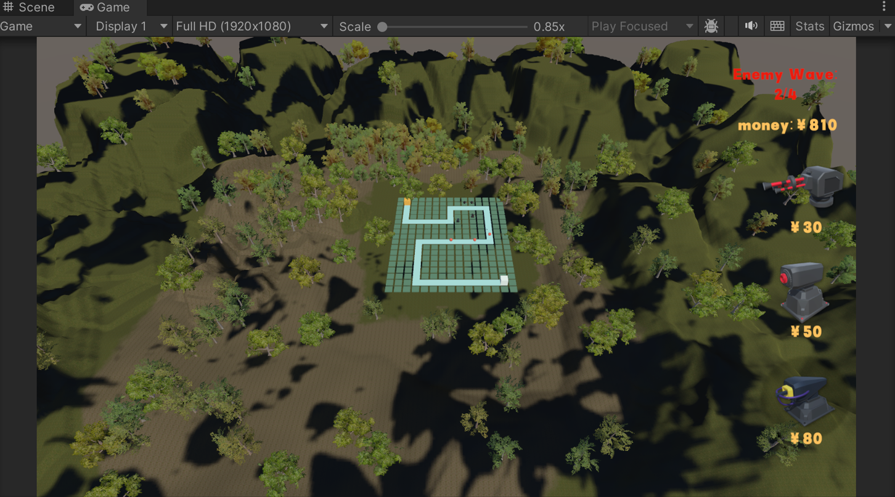
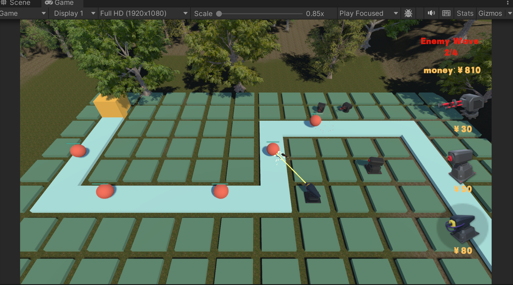
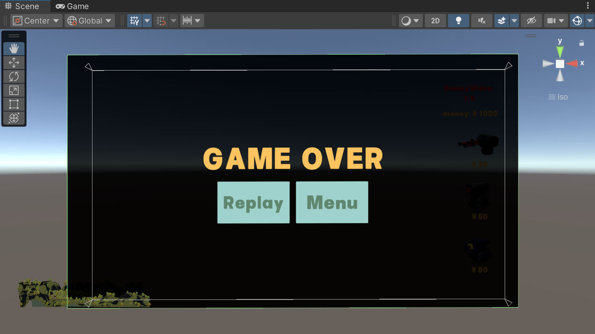
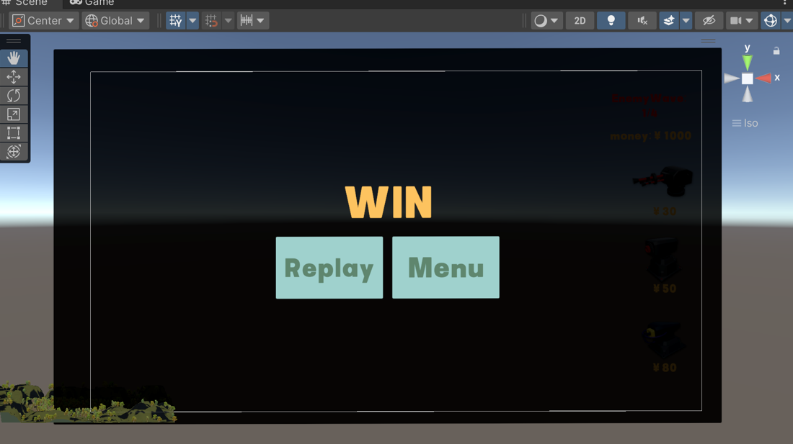

# Unity3d-TowerDefense
(Junior Year Game Project)Unity3D-based SLG Tower Defense Game Development

## Project Overview (项目简介)
This is a Tower Defense game developed using Unity, inspired by [Siki Academy](https://www.sikiedu.com/course/1885?ff=b_siki). The game has been enhanced with additional features and modified visuals.

### Modifications (改动)
参考：[siki学院](https://www.sikiedu.com/course/1885?ff=b_siki)

在siki的基础上改动：
 - Custom UI for the start and end screens. 
- Green color scheme (personal preference!).
- Added mountainous forest background.
- Added "Enemy Wave" UI display.
- Tweaked enemy and turret parameters (speed, damage, etc.).

**修改版本开源已征得原作者同意。**
### Screenshots 运行截图

![Main Menu]pictures/Main Menu.png)

### Documentation and References 文档和参考资料

并附有笔者自己写的文档，以供参考。
