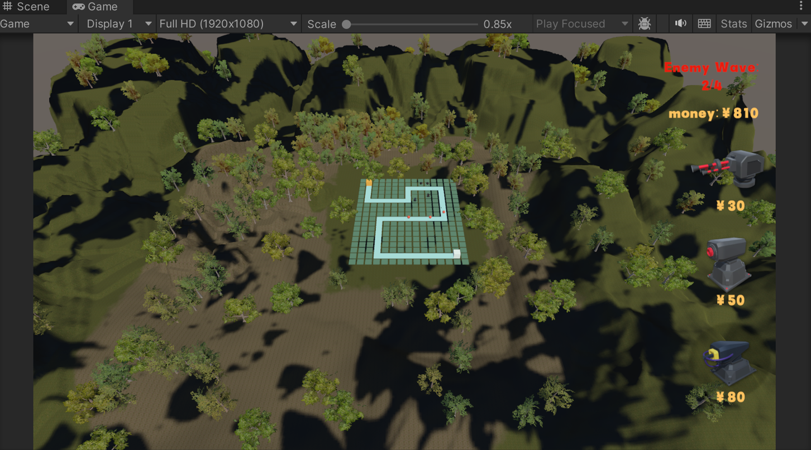
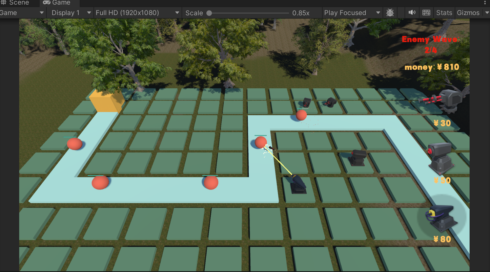
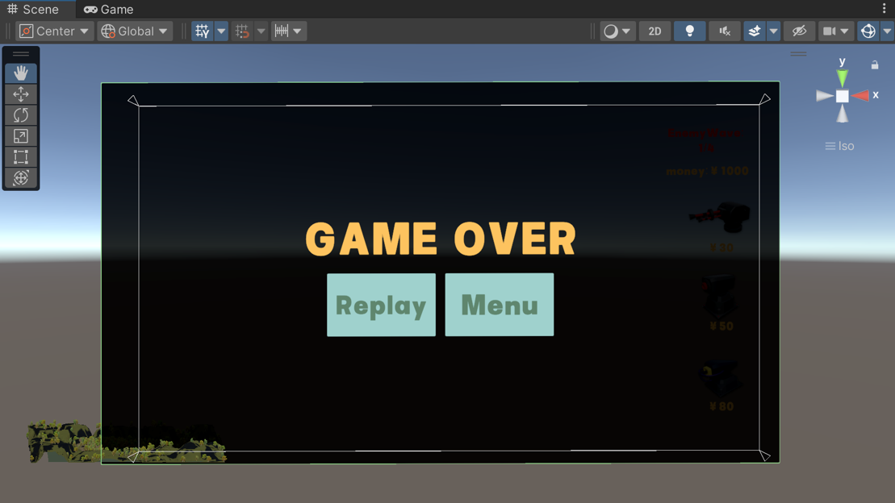
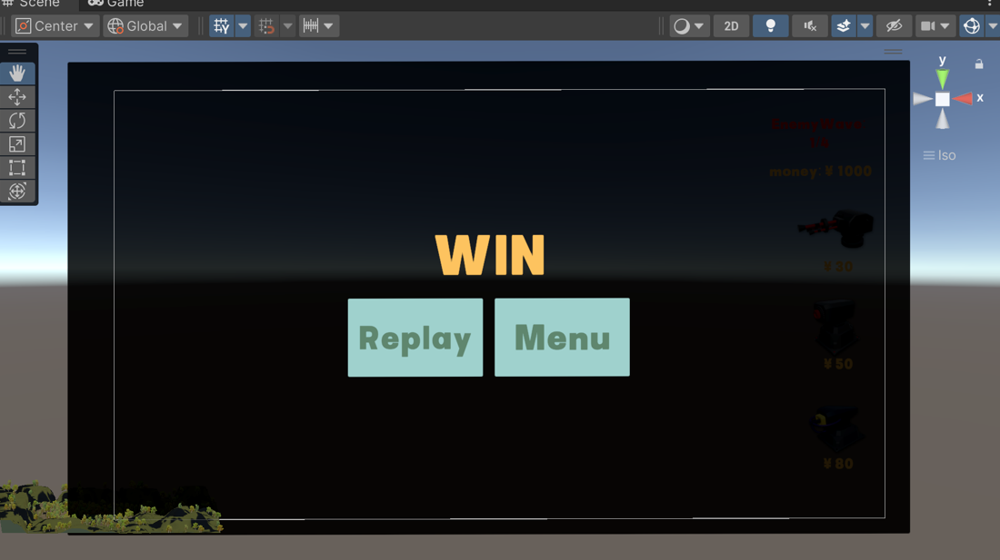
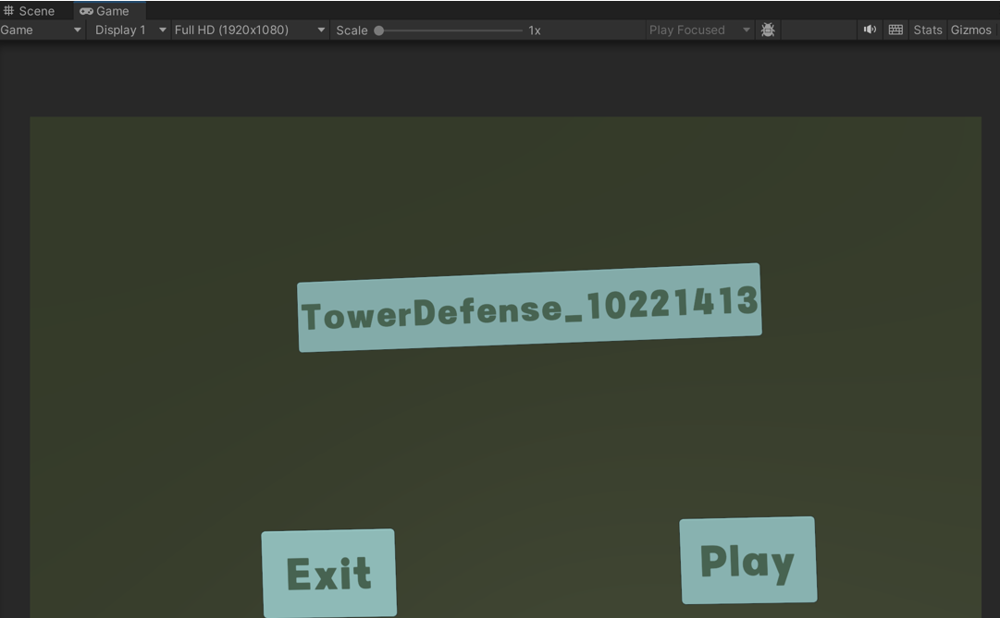

# Unity3d-TowerDefense
(Junior Year Game Project)Unity3D-based SLG Tower Defense Game Development

## Project Overview (项目简介)
This is a Tower Defense game developed using Unity, inspired by [Siki Academy](https://www.sikiedu.com/course/1885?ff=b_siki). The game has been enhanced with additional features and modified visuals.

### Modifications (改动)
参考：[siki学院](https://www.sikiedu.com/course/1885?ff=b_siki)

在siki的基础上改动：
 - Custom UI for the start and end screens. 
- Green color scheme (personal preference!).
- Added mountainous forest background.
- Added "Enemy Wave" UI display.
- Tweaked enemy and turret parameters (speed, damage, etc.).

**修改版本开源已征得原作者同意。**
### Screenshots 运行截图

## 一．游戏项目基本信息

| **游戏名称**     | 基于 Unity3D 的 SLG 塔防游戏                                 |
| ---------------- | ------------------------------------------------------------ |
| **游戏类型**     | SLG 塔防游戏                                                 |
| **游戏规则描述** | **游戏胜负条件**                                             |
|                  | 玩家需要击败所有波次的敌人，防止敌人到达终点，则玩家胜利。如果有敌人到达终点，则玩家失败。 |
|                  | **游戏操作方法**                                             |
|                  | 玩家通过鼠标点击布置塔的位置和类型。通过键盘上下左右或 WSAD 键控制摄像机移动视角，鼠标滚轮控制缩放。 |
|                  | **游戏玩法描述**                                             |
|                  | 每波敌人有不同的属性和数量。玩家花费金币建造/升级武器塔抵御敌人。 |

---

## 二．游戏项目结构

### **游戏角色介绍**
| 属性介绍                     |
| ---------------------------- |
| Enemy 1：速度 10，生命值 100 |
| Enemy 2：速度 15，生命值 300 |
| Enemy 3：速度 20，生命值 300 |
| Enemy 4：速度 20，生命值 400 |

### **游戏道具介绍**
| 属性介绍                                       |
| ---------------------------------------------- |
| 标准炮台：价格 30，攻击频率 1，攻击力 50       |
| 升级标准炮台：价格 40，攻击频率 0.7，攻击力 50 |
| 炮弹炮台：价格 50，攻击频率 1，攻击力 70       |
| 升级炮弹炮台：价格 60，攻击频率 0.7，攻击力 70 |
| 激光炮台：价格 80，每秒伤害 60                 |
| 升级激光炮台：价格 100，每秒伤害 100           |
| 标准炮台子弹：攻击力 50，速度 50               |
| 炮弹炮台导弹：攻击力 70，速度 30               |

### **游戏 UI 界面设计**
| 功能描述                                   |
| ------------------------------------------ |
| 开始/菜单界面：选择开始游戏或退出游戏      |
| 建造界面：选择炮塔、显示剩余金钱和敌人波次 |
| 结束界面：显示游戏结果（胜利/失败）        |
| 提供“重新开始”和“返回主菜单”按钮           |

### **游戏场景设计**
| 场景介绍         |
| ---------------- |
| 外部山体森林场景 |
| 游戏方格地图     |

### **游戏脚本**
| 脚本名称         | 脚本功能                             |
| ---------------- | ------------------------------------ |
| CameraController | 控制摄像机的移动和缩放               |
| WayPoints        | 管理敌人的行走路径                   |
| Enemy            | 控制敌人对象行为（移动、掉血、死亡） |
| EnemySpawner     | 管理敌人生成                         |
| wave             | 设置一波敌人的属性                   |
| TurretData       | 存储炮台数据                         |
| BuildManager     | 管理炮台建造和升级                   |
| MapCube          | 地图方块交互（建造炮塔特效）         |
| Turret           | 炮塔行为（发现敌人、瞄准、射击）     |
| Bullet           | 控制子弹行为                         |
| UpgradeUI        | 管理炮塔升级/拆除的 UI 面板          |
| LaserTurret      | 继承 Turret，实现激光炮塔攻击逻辑    |
| GameManager      | 管理游戏状态和结束 UI                |
| GameEndUI        | 处理游戏结束界面                     |
| MenuController   | 管理开始菜单按钮行为                 |

---

## 三．关键代码

### 1. 敌人移动、掉血及死亡功能
**功能描述**  
- 初始化敌人位置和生命值，沿预设路径移动。
- 到达终点触发游戏失败 (`GameManager.Instance.Fail()`)。
- 受伤害时减少生命值，生命值 ≤0 时销毁敌人并播放爆炸效果。  

### 2. 敌人生成功能
**功能描述**  
- 按波次生成敌人，波次间隔 5 秒。
- 协程异步生成，确保当前波次敌人全灭后再生成下一波。
- 更新 UI 显示当前波次。  

### 3. 炮塔建造、升级和拆除功能
**功能描述**  
- `BuildManager`：单例模式管理建造/升级逻辑，判断金钱是否充足。
- `UpgradeUI`：控制升级/拆除界面的显示和操作。  

### 4. 炮塔自动瞄准和攻击敌人
**功能描述**  
- 通过触发器检测敌人进入攻击范围。
- 炮塔头部朝向目标敌人 (`LookAt`)。
- 按攻击频率发射子弹。  

### 5. 子弹追踪与伤害功能
**功能描述**  
- 子弹追踪目标 (`LookAt(target.position)`)。
- 近距离命中时调用 `Enemy.TakeDamage()`。
- 命中后播放爆炸效果并销毁。  

### 6. 激光炮塔攻击功能
**功能描述**  
- 继承 `Turret`，重写 `Attack` 方法。
- 使用 `LineRenderer` 绘制激光并持续造成伤害。  

### 7. 游戏结束界面功能
**功能描述**  
- `GameManager`：检测胜负状态，显示对应 UI（“WIN”/“GAME OVER”）。
- `GameEndUI`：控制结束界面的动画和按钮事件（重新开始/返回菜单）。  

### 8. 开始菜单功能
**功能描述**  
- “Play” 按钮加载场景 1 开始游戏。
- “Exit” 按钮调用 `Application.Quit()` 退出游戏。  

---

## 四．游戏测试结果与分析
| 测试功能                 | 结果     |
| ------------------------ | -------- |
| 摄像机控制 (移动/缩放)   | 符合预期 |
|                          |          |
| 敌人生成与波次管理       | 符合预期 |
| 炮塔建造/升级/拆除       | 符合预期 |
| 炮塔自动瞄准攻击         | 符合预期 |
| 敌人移动/掉血/死亡       | 符合预期 |
| 金钱不足提示 (UI闪烁)    | 符合预期 |
| 子弹/激光攻击效果        | 符合预期 |
| 游戏结束界面 (胜利/失败) | 符合预期 |
|                          |          |
| 开始菜单功能             | 符合预期 |

---

## 五．总结
| 知识点         | 是否用到 | 应用描述                     |
| -------------- | -------- | ---------------------------- |
| Transform 类   | 是       | 摄像机移动、敌人路径控制     |
| Vector3 工具类 | 是       | 敌人移动路径计算             |
| Time 工具类    | 是       | 敌人移动速度计算             |
| Random 工具类  | 否       | (未开发随机敌人)             |
| 输入控制       | 是       | 摄像机移动和缩放             |
| 协程           | 是       | 敌人生成逻辑                 |
| 地形系统       | 是       | 森林场景搭建                 |
| 摄像机控制     | 是       | 玩家视角控制                 |
| Mecanim 动画   | 是       | 炮塔升级动画、金钱文本闪烁   |
| 碰撞检测       | 是       | 子弹击中敌人                 |
| 触发器         | 是       | 检测敌人进入炮塔攻击范围     |
| 射线           | 否       |                              |
| 粒子系统       | 是       | 爆炸、建造特效、激光效果     |
| UI 界面        | 是       | 炮塔选择/游戏菜单/结束界面   |
| 数据存储       | 是       | 游戏字体配置                 |
| 导航网格       | 否       |                              |
| **扩展技术**   |          |                              |
| 单例模式       | 是       | GameManager, BuildManager 等 |
| 对象实例化     | 是       | 动态生成敌人/子弹/特效       |
| LineRenderer   | 是       | 激光炮塔攻击效果             |
